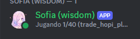
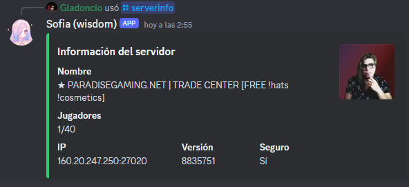

# Bot de Discord para monitoreo de servidores de Steam



 
## Este bot de Discord está diseñado para monitorear el estado de servidores de Steam y mostrar esta información en un canal de Discord. Actualmente, solo ofrece soporte para servidores de Steam.

## Requisitos

Antes de ejecutar este bot, asegúrate de tener instalado Docker y Docker Compose en tu sistema.


## Configuración
Rellena el archivo config.json con la siguiente información:

```
{
    "steam_code": "",
    "server_ip": "160.20.247.250",
    "server_port": 27020,
    "update_interval_seconds": 30,
    "discord_bot_token": "",
    "url_image" : ""
}
```

steam_code: El código de tu cuenta de Steam para acceder a la API de Steam.

```
https://steamcommunity.com/dev/apikey

```

server_ip: La dirección IP del servidor de Steam que deseas monitorear.
server_port: El puerto del servidor de Steam.
update_interval_seconds: El intervalo de actualización en segundos para verificar el estado del servidor.
discord_bot_token: El token de autenticación del bot de Discord.

```
https://discord.com/developers/applications

```

url_image: La URL de la imagen que deseas usar como avatar del bot en Discord.

### Ejecuta el comando siguiente para construir la imagen de Docker:

```
docker-compose build
```

### Luego, ejecuta el siguiente comando para iniciar el contenedor:
```
docker-compose up
```
## Uso
Una vez que el bot esté en línea en tu servidor de Discord, puedes invocar los comandos que hayas configurado. Para obtener más información sobre los comandos disponibles, consulta la documentación del bot.

# comandos disponibles

## avatar: 
Imprime el avatar de un usuario especifico
```
/avatar
```
## serverinfo: 

Muestra la informacion del servidor

```
/serverinfo
```
## clear: (solo personas con admin)

Permite borrar mensajes de un canal mas facil, por cantidad con un máximo de 15.


Asegúrate de reemplazar TOKEN_DEL_BOT_DE_DISCORD y URL_DE_LA_IMAGEN_DEL_BOT con los valores correspondientes. Además, puedes agregar cualquier otro detalle relevante sobre el uso y la configuración del bot en tu README según sea necesario.